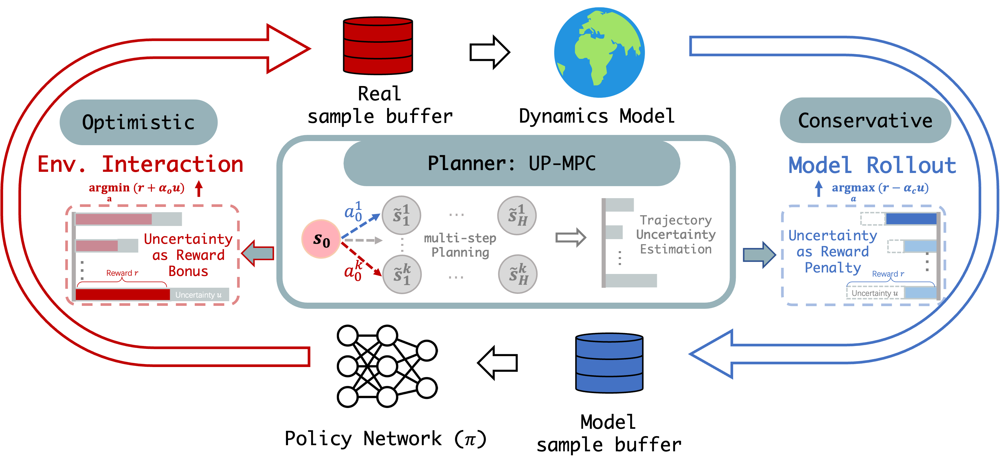

  <h1 align="center">COPlanner: Plan to Roll Out Conservatively but to Explore Optimistically for Model-Based RL</h1>
  <h2 align="center">ICLR 2024 </h2>
  

    <a><strong>Xiyao Wang</strong></a>
    ·
    <a><strong>Ruijie Zheng</strong></a>
    ·
    <a><strong>Yanchao Sun</strong></a>
    ·
    <a><strong>Ruonan Jia</strong></a>
    ·
    <a><strong>Wichayaporn Wongkamjan</strong></a>
    ·
    <a><strong>Huazhe Xu</strong></a>
    ·
    <a><strong>Furong Huang</strong></a>
  

<h3 align="center">
  <a href="https://arxiv.org/abs/2310.07220"><strong>arXiv</strong></a>
</h3>

  

